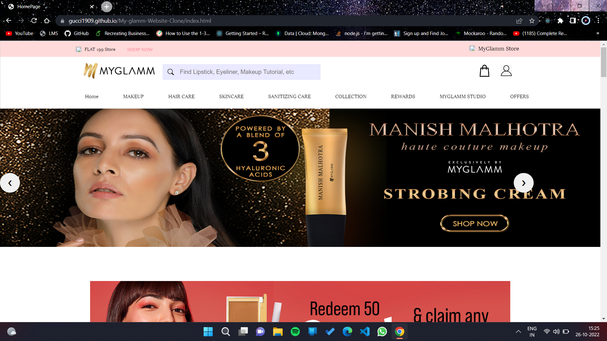

# My glamm

>MyGlamm is an Indian e-commerce company that sells cosmetics and personal care products. It was a group project and we made the clone website of Myglamm in which we created Home page , Make up products page , Single product page, Cart page ,Delivery location page and Payment page

## Built With

- Javascript
- Html5
- Css3
- Api - which identifies your current location
- Local Storage
- Bootstrap

## Live Demo 

[Deployed link available here](https://gucci1909.github.io/My-glamm-Website-Clone/)

## Screenshots

### Prerequisites
Javascript , Html5 , Css3 , Local Storage , Bootstrap

### Setup
VS code,
GitHub

## Authors

👤 **Umang Arora**

- GitHub: [@gucci1909](https://github.com/gucci1909)

👤 **Subham Kumar Ram**

- GitHub: [@shubham020719](https://github.com/shubham020719)

👤 **Ashutosh**

- GitHub: [@Ashutosh5333](https://github.com/Ashutosh5333)

👤 **Saurabh**

- GitHub: [@saurabhvmagdum](https://github.com/saurabhvmagdum)

